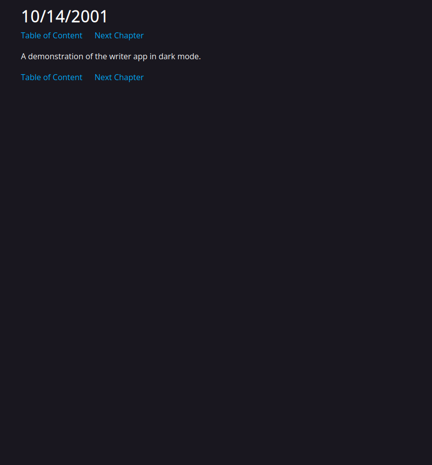

# Project
StarCMS is a web-based word processor with a very niche use case.


*A picture of what the writer mode looks like.*



*A picture of what the reader mode looks like.*

## Purpose
This project's use case is for creating and managing any document that severely relies on paging while providing a streamlined workflow for publishing to the web.
This particularly exists for the two following purposes:
- Webnovels
- Blogs

### What current software exist for such?
- Github Gists
- Wordpress
- Blog post pages
- OneNote
- Obsidian
- Word/Docs

### Benefits compared to...
Gists
- Significantly more powerful editor
- Bucket filesystem for complex hierarchies of blogs

Wordpress
- Significantly more powerful editor
- Built-in rails for hierachy intead of manual

Onenote/Obsidian
- Contains streamlined pipe to web
- Complex multi-tier "notebooks" instead of just 1

Word/Docs
- Most do not think of each page as an individual document, and lack features for pages (e.g, word count per page)
- Clunky export integration pipeline (no CI/CD to publish to web)
- Peformance issues on those with individual pages. (not good for >300 pages)

## Current Status
Currently in alpha. There may be security issues, and is not ready for public endpoints.

Unsecure.

- Createusers endpoint can be spammed to flood database and prevent normal users (needs a rate limit)
- Bucket and page endpoints can be flooded to waste storage (needs storage cap)
- Certain APIs may or may not be unsecure. None are documented, because any known would've been fixed, but be aware.

Other problems

- GUI is not in any good shape.
- Many skeletons in the API.
- Documententation of code subpar.
- Word spelling suggestions are very slow and freeze webpage (currently issue with Typo.js)

## Usage Notes
Create a venv, install reqs.txt. Create a .env file, and place tinymce url into it.
Then, create a sqlite3 database in the directory called app.db. and run the following command to bring up the webserver:\

```uvicorn app.main:app --host 0.0.0.0```

Then, navigate to the URL. It does not have a functional GUI to create users, so go to the URL/docs, and use the "Try It" button in the FastAPI docs. The app is now ready, but do note that to delete pages, buckets, or users, you must use SQL and execute it on the app.db.

## Toolchain and framework
All new projects must have their toolchain and framework defined before the project starts.

If new tools need to be added during project, they must have a good reason.

- Python with FastAPI.
- Database with SQLite/PostgreSQL
- TinyMCE for frontend editing.
- Raw HTML on frontend
